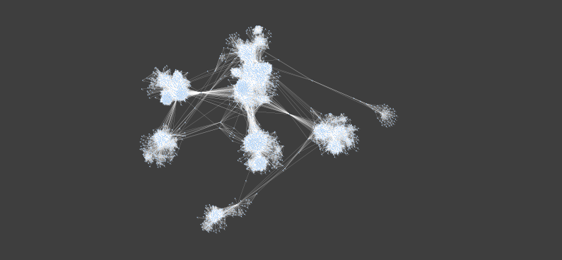

## Objective: Study the problem of spreading on a social network

## Intro

```{r, include=F}
# Libraries 
library(tidyverse)
library(igraph)
library(ggthemes)
library(moments)
library(knitr)
```

**Network**: Social Circles in Ego Networks on Facebook.

McAuley, J. & Leskovec, J. (2012). Learning to discover social circles in ego networks. *Advances in Neural Information Processing Systems, 25*, 539-547. <https://doi.org/10.48550/arXiv.1210.8182>

### Network Setup

```{r}
# Load Network 
edgelist <- read.table("facebook_combined.txt")
# Create the graph 
g <- graph_from_data_frame(edgelist, directed = FALSE)
g <- simplify(g)

# Check number of nodes and edges
vcount(g) # Number of nodes 
ecount(g) # Number of edges

# Check if the network connected
is_connected(g) #TRUE

deg <- degree(g, mode = "all")
mean(deg)
sd(deg)
median(deg)
# Check skew
skewness(deg) 
```

### Network Attributes

The network returns a total of 4,039 nodes and 88,234 links. The total number of nodes represent individual Facebook profiles and the edges are an undirected representation of Facebook friendship connections between profiles. The mean degree (M = 43.69, 2dp), median (Mdn = 25) and standard deviation (sd = 52.42, 2dp) indicated a positively skewed degree distribution with high variability.

A skewness coefficient of 4.52 (2dp) confirmed the positive skew and is consistent with the presence of highly concentrated degrees typical of social networks. To acknowledge this, the epidemic threshold is computed using the heterogeneous mean-field formula β_c = μ⟨k⟩/(⟨k²⟩ − ⟨k⟩), which accounts for degree variance. Furthermore, the evidence of the skew further motivates the use of degree-based centrality for targeted seeding and immunisation strategies in subsequent analyses, where highly central nodes are expected to play a disproportionate role in spreading dynamics.

### Interpreting the Network 

The analysis for this task interprets misinformation spread as analogous to an infectious process. Specifically, susceptible (S) nodes represent individuals not yet exposed to the misinformation; infected (I) nodes represent active spreaders; and recovered (R) nodes represent individuals who have ceased spreading, via having acquired a form of digital literacy . Separately, immunisation strategies (Steps 4–5) are modelled as the deliberate removal of nodes, representing targeted interventions to prevent spread. Whilst this analogy simplifies the complexity of misinformation spread and dynamics, it provides an empirically grounded framework for the analyses of this task.

## Steps

### Step 0: SIR Function (original / no-quarantine)

```{r}
# Code from Tutorial - No change required
sim_sir <- function(g, beta, mu, seeds){
  state <- rep(0, vcount(g)) #initial state of the simulation
  state[seeds] <- 1 #infect the seeds
  t <- 0
  table <- data.frame(t = 0, inf = seeds)
  while(sum(state == 1) > 0){
    t <- t + 1
    ## I -> R
    infected <- which(state == 1) # infected nodes
    # generate a random value for every infected, if it's < mu, let the node recover.
    state[infected] <- ifelse(runif(length(infected)) < mu, 2, 1)
    
    ## S -> I
    infected <- which(state == 1) # nodes still infected
    susceptible <- which(state == 0) # susceptible nodes
    contacts <- as.numeric(unlist(adjacent_vertices(g, infected))) # contacts of infected
    contacts <- contacts[contacts %in% susceptible] # get those who are susceptible
    new_infected <- contacts[runif(length(contacts)) < beta] # infect contacts
    new_infected <- unique(new_infected) # remove repeated infections
    if(length(new_infected) > 0){
      state[new_infected] <- 1
      table <- rbind(table, 
                     data.frame(t, inf = new_infected))
    }
  }
  table
}
```

### Step 1: Epidemic Threshold

Using the heterogeneous mean-field formula the epidemic threshold was calculated as βc = 0.00095 (5 dp). Misinformation spread on social media has been estimated with Twitter specific estimates of R0 = 4.0-5.1 under the SIR model (Cinelli et al., 2020). Using the relationship β = R0 · βc, a transmission rate of β = 0.00475 corresponds to R0 = 5, placed clearly above the threshold. A value of β = 0.006 was selected for subsequent analyses to ensure β was well above the threshold but remained theoretically relevant to the specifics of the network and a socially plausible transmission parameter for modelling misinformation spread.

```{r}
# Beta_c  
mu <- 0.1
kavg <- mean(degree(g))
ksq  <- mean(degree(g)^2)
betac <- mu*kavg/(ksq - kavg)
betac

# above-threshold beta estimate 
5 * betac
```

### Step 2: Simulate SIR

Assuming that randomly-selected 1% initial spreaders, simulate the SIR model for a range below and above that threshold and plot the number of infected people as a function of β.

The plot below shows the total number of infected nodes as a function of transmission rate β, with the theoretical epidemic threshold βc = 0.00095 marked by the dashed vertical line. Below the threshold, infections remain negligible as the epidemic fails to activate throughout the network. Above the threshold, the number of infected nodes increases substantially with β, consistent with theoretical predictions of epidemic spread in heterogeneous networks. Currently, the variability observed across β values reflects the random disposition of the single realisation simulated per parameter value, where averaging over multiple realisations would produce a smoother transition and be more robust (not done due to being too computationally expensive). At the selected above-threshold value of β = 0.006, approximately 1953 nodes were infected, representing 48.4% of the network.

```{r}
# calculate for each realisation the number of total infections, trying for different values of β and fixed μ. 
set.seed(246)
# beta range
results <- map_dfr(seq(0, 0.006, 0.0001),
        \(beta){seeds <- sample(1:vcount(g),
                                vcount(g) * 0.01)
        # make a realisation for each beta
        realisation <- sim_sir(g, beta, mu, seeds) 
        # create dataframe row
        data.frame(beta, ninf = nrow(realisation)) 
          })
# Visualise
results |> 
  ggplot(aes(x = beta, y = ninf)) + 
  geom_point() +
  geom_vline(xintercept = betac, 
             linetype = 2)


# Number of infected nodes at the 0.006 above-threshold 
results_above <- results |> filter(beta == 0.006)
cat("Nodes infected:", results_above$ninf, 
    "\nPercentage of network:", 
    round(results_above$ninf / vcount(g) * 100, 1), "%")
```

### Step 3: Maximising Infection

Now let's see if we can maximize the infection. Let's compare a sample of 40 random nodes (1% of our network) to a selection of nodes chosen by centrality metrics. Specifically, we will select nodes that are more central to the network, meaning that they are the closest to all the other nodes in the network on average. we will calculate the degree of all nodes, meaning the amount of edges they have, and take the top 40 to act as our "super-spreaders". After that, we can the simulation with a β equal to 0.006, which is well above our epidemic threshold (βc).

```{r}
set.seed(2026)

# Random spreaders
seeds_random <- sample(1:vcount(g), 
                       floor(vcount(g) *0.01)) # 40

# centrality-based spreaders
seeds_centrality <- degree(g) |> 
  enframe(name = "inf", 
          value = "degree") |>
  mutate(inf = match(inf, V(g)$name)) |> 
  slice_max(degree, 
            n = 40) 

# Random seeds simulation

raw_random <- sim_sir(g, beta = 0.006, mu = 0.1, seeds_random)

realisation_random <- raw_random |> 
  group_by(t) |> 
  summarize(ninf = n())

# Central seeds simulation

raw_targeted <- sim_sir(g, beta = 0.006, mu = 0.1, 
                        seeds_centrality$inf)

realisation_targeted <- raw_targeted |> 
  group_by(t) |> 
  summarize(ninf = n())


# Infection curve
ggplot() + 
  geom_line(data = realisation_random,
            aes(x = t, y = ninf,
                col = "Random")) +
  geom_line(data = realisation_targeted,
            aes(x = t, y = ninf,
                col = "Targeted")) +
  theme_minimal()
```

We can see that the targeted simulation peaks faster than than the random simulation, but the results don't seem to be different enough. The calculation which can be found below shows that there was a difference of 164 total infected between the random (2106 infected) and the targeted simulation (2270 infected). The targeted simulation peaked at t = 3, while the random simulation had a lower and slower peak at t = 11.

```{r}
# a) Difference in total infected 
total_random <- nrow(raw_random)
total_targeted <- nrow(raw_targeted)
diff_total <- total_targeted - total_random
# b) Difference in time of peak infection 
peak_random <- realisation_random$t[which.max(realisation_random$ninf)]
peak_targeted <- realisation_targeted$t[which.max(realisation_targeted$ninf)]
diff_peak <- peak_random - peak_targeted

# Display results 
data.frame(
  Metric = c("Total Infected", "Peak Infection Time"),
  Random = c(total_random, peak_random),
  Targeted = c(total_targeted, peak_targeted),
  Difference = c(diff_total, diff_peak)) |>
  kable(caption = "Comparison of Random vs Targeted Seeding")
```

Yet, this result comes with a caveat. Given that this is a stochastic simulation, the result changes each time you do the simulation. For example, if we set any other seed, we can get a negative result.

```{r}
set.seed(123)

# Random spreaders
seeds_random <- sample(1:vcount(g), 
                       floor(vcount(g) *0.01)) # 40

# centrality-based spreaders
seeds_centrality <- degree(g) |> 
  enframe(name = "inf", 
          value = "degree") |>
  mutate(inf = match(inf, V(g)$name)) |> 
  slice_max(degree, 
            n = 40) 

# Random seeds simulation

raw_random <- sim_sir(g, beta = 0.006, mu = 0.1, seeds_random)

realisation_random <- raw_random |> 
  group_by(t) |> 
  summarize(ninf = n())

# Central seeds simulation

raw_targeted <- sim_sir(g, beta = 0.006, mu = 0.1, 
                        seeds_centrality$inf)

realisation_targeted <- raw_targeted |> 
  group_by(t) |> 
  summarize(ninf = n())


# Infection curve
ggplot() + 
  geom_line(data = realisation_random,
            aes(x = t, y = ninf,
                col = "Random")) +
  geom_line(data = realisation_targeted,
            aes(x = t, y = ninf,
                col = "Targeted")) +
  theme_minimal()
```

As we can see below, in these particular cases, we get 10 infections less in the targeted simulation, even though it peaked faster.

```{r}
# a) Difference in total infected 
total_random <- nrow(raw_random)
total_targeted <- nrow(raw_targeted)
diff_total <- total_targeted - total_random
# b) Difference in time of peak infection 
peak_random <- realisation_random$t[which.max(realisation_random$ninf)]
peak_targeted <- realisation_targeted$t[which.max(realisation_targeted$ninf)]
diff_peak <- peak_random - peak_targeted

# Display results 
data.frame(
  Metric = c("Total Infected", "Peak Infection Time"),
  Random = c(total_random, peak_random),
  Targeted = c(total_targeted, peak_targeted),
  Difference = c(diff_total, diff_peak)) |>
  kable(caption = "Comparison of Random vs Targeted Seeding")
```

Stochastic simulations should be averaged so that the results are not skewed because a specifically positive/negative simulation. However, when doing this, it doesn't change the result much. The random simulations have 161 more infected.

```{r}
set.seed(2026)

# Seed selection - done once, outside the loop
seeds_random <- sample(1:vcount(g), floor(vcount(g) * 0.01))

seeds_centrality <- degree(g) |>
  enframe(name = "inf", value = "degree") |>
  mutate(inf = match(inf, V(g)$name)) |>
  slice_max(degree, n = 40)

# Run 20 simulations for each strategy
n_sims <- 20

results_random <- map_dfr(1:n_sims, ~
  sim_sir(g, beta = 0.006, mu = 0.1, seeds_random) |>
    group_by(t) |>
    summarize(ninf = n()) |>
    mutate(sim = .x)
)

results_targeted <- map_dfr(1:n_sims, ~
  sim_sir(g, beta = 0.006, mu = 0.1, seeds_centrality$inf) |>
    group_by(t) |>
    summarize(ninf = n()) |>
    mutate(sim = .x)
)

# Average across simulations
avg_random <- results_random |>
  group_by(t) |>
  summarize(ninf = mean(ninf))

avg_targeted <- results_targeted |>
  group_by(t) |>
  summarize(ninf = mean(ninf))

# Plot
ggplot() +
  geom_line(data = avg_random,
            aes(x = t, y = ninf, col = "Random")) +
  geom_line(data = avg_targeted,
            aes(x = t, y = ninf, col = "Targeted")) +
  labs(title = "SIR Infection Curves: Random vs Targeted (avg of 20 runs)",
       x = "Time", y = "New Infections", colour = "Seeding Strategy") +
  theme_minimal()

# a) Difference in total infected
total_random <- sum(avg_random$ninf)
total_targeted <- sum(avg_targeted$ninf)
cat("Difference in total infected:", total_targeted - total_random, "\n")

# b) Difference in peak time
peak_random <- avg_random$t[which.max(avg_random$ninf)]
peak_targeted <- avg_targeted$t[which.max(avg_targeted$ninf)]
cat("Difference in peak time:", peak_random - peak_targeted, "steps\n")
```

There are two possible reasons for this: either it is the centrality metric, which needs to be changed, or it is the structure of the network itself. We will use communities instead to take the most central nodes of each community to maximize infection. We will use the louvain algorithm, which inferes communities by how dense specific parts of the networks are.

```{r}
set.seed(2026)

# Detect communities
communities <- cluster_louvain(g)

# Centrality for every node with data on which community it is in
node_data <- enframe(closeness(g), name = "inf", value = "closeness") |>
  mutate(inf = as.numeric(inf),
         community = membership(communities))

# Pick best 5 nodes per community, then top 40
seeds_community <- node_data |>
  group_by(community) |>
  slice_max(closeness, n = 1) |>
  ungroup() |>
  slice_max(closeness, n = 40)


realisation_random <- sim_sir(g, beta = 0.006, mu = 0.1, 
                              seeds_random) |> 
  group_by(t) |> 
  summarize(ninf = n())
# community-central seeds simulation
realisation_community <- sim_sir(g, beta = 0.006, mu = 0.1,
                                as.numeric(seeds_community$inf)) |>
  group_by(t) |> 
  summarize(ninf = n())

# Infection curve
ggplot() + 
  geom_line(data = realisation_random,
            aes(x = t, y = ninf,
                col = "Random")) +
  geom_line(data = realisation_community,
            aes(x = t, y = ninf,
                col = "Targeted")) +
  theme_minimal()
```

Still, targeted simulations are not significantly different to random simulations. When looking at a visualization of the network it becomes more clear why:



The components are very densely connected within themselves but not with each other. This means that when there is a random seeding, the seed will probably be highly connected, which explains why the difference with the targeted simulations isn't big and that it can even be that random seeds get more people infected.

### Step 4: Quarantine Strategy

```{r}
# Modified SIR function with quarantine
sim_sir_quarantine <- function(g, beta, mu, seeds,
                                quarantine_t = 3,
                                quarantine_pct = 0.20,
                                release_after = 8) {
  state <- rep(0, vcount(g))
  state[seeds] <- 1
  t <- 0
  quarantine_release <- list()
  table <- data.frame(t = 0, inf = seeds)

  while(sum(state == 1) > 0 || any(state == 3)) {
    t <- t + 1

    # Release quarantined nodes back to susceptible at the right time step
    if (!is.null(quarantine_release[[as.character(t)]])) {
      state[quarantine_release[[as.character(t)]]] <- 0
    }

    # At quarantine_t, randomly remove 20% of susceptible nodes
    if (t == quarantine_t) {
      susceptible <- which(state == 0)
      n_q <- round(length(susceptible) * quarantine_pct)
      quarantined <- sample(susceptible, n_q)
      state[quarantined] <- 3  # state 3 = quarantined
      quarantine_release[[as.character(t + release_after)]] <- quarantined
    }

    ## I -> R
    infected <- which(state == 1)
    state[infected] <- ifelse(runif(length(infected)) < mu, 2, 1)

    ## S -> I (quarantined nodes cannot be infected)
    infected <- which(state == 1)
    susceptible <- which(state == 0)
    contacts <- as.numeric(unlist(adjacent_vertices(g, infected)))
    contacts <- contacts[contacts %in% susceptible]
    new_infected <- contacts[runif(length(contacts)) < beta]
    new_infected <- unique(new_infected)
    if (length(new_infected) > 0) {
      state[new_infected] <- 1
      table <- rbind(table, data.frame(t, inf = new_infected))
    }
    if (sum(state == 1) == 0 && !any(as.numeric(names(quarantine_release)) > t)) {
      break    
    } 
  }
  table
}

# Run quarantine simulation using same seeds_random as Step 3
realisation_quarantine <- sim_sir_quarantine(g, beta = 0.006, mu = 0.1,
                                              seeds_random) |>
  group_by(t) |>
  summarize(ninf = n())
```


```{r}
# Plot: no quarantine (reuse realisation_random from Step 3) vs quarantine
ggplot() +
  geom_line(data = realisation_random,
            aes(x = t, y = ninf, col = "No Quarantine")) +
  geom_line(data = realisation_quarantine,
            aes(x = t, y = ninf, col = "Quarantine")) +
  labs(title = "Step 4: Quarantine Strategy",
       x = "Time", y = "New infections", col = "Strategy") +
  theme_minimal()
```

The random 20% quarantine strategy shows no significant difference in total infections or peak time compared no-quarantine. This is because the facebook network made of tightly connected, closed groups of friends with very few links connecting one group to another. Once a rumor or virus gets inside a group, random internal quarantines will not stop it from spreading to everyone in that group.

```{r}
# a) Difference in total infected
total_no_q <- sum(realisation_random$ninf)
total_q    <- sum(realisation_quarantine$ninf)
cat("Difference in total infected:", total_no_q - total_q, "\n")

# b) Difference in peak time
peak_no_q <- realisation_random$t[which.max(realisation_random$ninf)]
peak_q    <- realisation_quarantine$t[which.max(realisation_quarantine$ninf)]
cat("Difference in peak time:", peak_q - peak_no_q, "steps\n")
```

The results show almost no change, with only 3 fewer infections and a small 3-step delay in the peak time. This proves that randomly separating a few people inside a group does not stop the spreading. This is because the different friend groups are so isolated from one another, that what ever happens inside them barely affects the rest of the network.

### Step 5:  Minimising Spread 

Now, let's suppose 5 % of nodes in the network don't to spread that information, e.g that they are immune to the disease. 5 % is in our case 201 nodes.

```{r}
n_immune <- floor(vcount(g) * 0.05) # 201
```

Let's randomly sample the immune nodes and do the same that we did before: sample 40 random nodes (1 % of the network) as seeds and select 40 high degree seeds to compare how both simulations compare to each if they were immune nodes in the network. Given what we said earlier, we will do 20 simulations of each and then compare the average number of infections. 

```{r}
# --- Random immunization ---
immune_random <- sample(1:vcount(g), n_immune)
remaining_random <- setdiff(1:vcount(g), immune_random)
seeds_immune_random <- sample(remaining_random, floor(length(remaining_random) * 0.01))

# --- Centrality-based immunization ---
immune_targeted <- degree(g) |>
  enframe(name = "inf", value = "degree") |>
  mutate(inf = match(inf, V(g)$name)) |>
  slice_max(degree, n = n_immune)
remaining_targeted <- setdiff(1:vcount(g), immune_targeted$inf)
seeds_immune_targeted <- sample(remaining_targeted, floor(length(remaining_targeted) * 0.01))

# --- Remove immunized nodes from graph ---
g_random <- delete_vertices(g, immune_random)
g_targeted <- delete_vertices(g, immune_targeted$inf)

# --- Run 20 simulations for each ---
n_sims <- 20

results_immune_random <- map_dfr(1:n_sims, ~
  sim_sir(g_random, beta = 0.006, mu = 0.1, 
          match(seeds_immune_random, remaining_random)) |>
    group_by(t) |>
    summarize(ninf = n()) |>
    mutate(sim = .x)
)

results_immune_targeted <- map_dfr(1:n_sims, ~
  sim_sir(g_targeted, beta = 0.006, mu = 0.1,
          match(seeds_immune_targeted, remaining_targeted)) |>
    group_by(t) |>
    summarize(ninf = n()) |>
    mutate(sim = .x)
)

# --- Average across simulations ---
avg_immune_random <- results_immune_random |>
  group_by(t) |>
  summarize(ninf = mean(ninf))

avg_immune_targeted <- results_immune_targeted |>
  group_by(t) |>
  summarize(ninf = mean(ninf))

# --- Plot ---
ggplot() +
  geom_line(data = avg_immune_random,
            aes(x = t, y = ninf, col = "Random Immunization")) +
  geom_line(data = avg_immune_targeted,
            aes(x = t, y = ninf, col = "Targeted Immunization")) +
  labs(title = "SIR Model: Random vs Targeted Immunization",
       x = "Time", y = "New Infections", colour = "Immunization Strategy") +
  theme_minimal()

# --- a) Difference in total infected ---
total_immune_random <- sum(avg_immune_random$ninf)
total_immune_targeted <- sum(avg_immune_targeted$ninf)
cat("Difference in total infected:", total_immune_random - total_immune_targeted, "\n")

# --- b) Difference in peak time ---
peak_immune_random <- avg_immune_random$t[which.max(avg_immune_random$ninf)]
peak_immune_targeted <- avg_immune_targeted$t[which.max(avg_immune_targeted$ninf)]
cat("Difference in peak time:", peak_immune_targeted - peak_immune_random, "steps\n")
```

### Step 6: Analysis

1.  Comment on the relationship between the findings in steps 3 and 5 using the same type of centrality for the 1% in step 3 and 5% in step 5.

Workflow: Discuss the results from Step 3 and Step 5. Didn't fully understand this step so asked Claude - response was: "The instruction is saying that whatever centrality metric you chose in step 3 to identify your best 1% seeds (e.g. closeness), you should use that same metric in step 5 to identify the 5% to vaccinate. You are asking whether the nodes that are best at spreading (step 3) are also the most important ones to suppress (step 5). Using different centrality metrics in each step would muddy that comparison."

### Step 7: Predictive Model

1.  Train a model that predicts that time to infection of a node using their degree, centrality, betweeness, page rank or any other predictors you see fit. Use that model to select the seed nodes as those with the smallest time to infection in step 3. Repeat step 5 with this knowledge.

#### Part A: Build the Predictive model

##### 1. Generate training data:

```{r}

set.seed(2026)

# Baseline infection times
seeds_train <- sample(1:vcount(g), vcount(g) * 0.01)
realisation_train <- sim_sir(g, beta = 0.006, mu = 0.1, seeds_train)
```

##### 2. Feature Extraction

```{r}
feat_degree    <- degree(g)             |> enframe(name = "inf", value = "degree")
feat_closeness <- closeness(g)          |> enframe(name = "inf", value = "closeness")
feat_between   <- betweenness(g)        |> enframe(name = "inf", value = "betweenness")
feat_pagerank  <- page_rank(g)$vector   |> enframe(name = "inf", value = "page_rank")
```

##### 3. Merge into one table

```{r}
## Convert inf to character so joins work correctly
feat_degree$inf    <- as.character(feat_degree$inf)
feat_closeness$inf <- as.character(feat_closeness$inf)
feat_between$inf   <- as.character(feat_between$inf)
feat_pagerank$inf  <- as.character(feat_pagerank$inf)

features <- feat_degree |>
  left_join(feat_closeness, by = "inf") |>
  left_join(feat_between,   by = "inf") |>
  left_join(feat_pagerank,  by = "inf")
```

##### 4. Merge features with infection times

```{r}
## Nodes never reached by the simulation are dropped (they have no infection time)
realisation_train$inf <- as.character(realisation_train$inf)
training_data <- features |>
  left_join(realisation_train, by = "inf") |>
  filter(!is.na(t))
```

##### 5. Fit model

```{r}
# model <- lm(t ~ ... , data = )
## Predicts time-to-infection (t) from network structure features
## A lower predicted t = spreads faster = better seed / more important to suppress
model <- lm(t ~ degree + closeness + betweenness + page_rank, data = training_data)
summary(model)  # Check which features are significant predictors
```

The model shows that degree, closeness, and page_rank are highly significant predictors of infection time, meaning that nodes with more connections, closer proximity to others, and a lower page rank tend to get infected earlier in the network.

##### 6. Predict time to infection for ALL nodes

```{r}
features$pred_t <- predict(model, newdata = features)
```

#### Part B: Re-run Step 3

Instead of picking seeds by centrality (Step 3), we pick the 1% of nodes with the smallest PREDICTED infection time - i.e. predicted to spread fastest

##### 7. Select smallest predicted infection time as seeds

```{r}
seeds_model_s3 <- features |>
  slice_min(pred_t, n = round(vcount(g) * 0.01)) |>
  pull(inf) 
seeds_model_s3_idx <- match(seeds_model_s3, V(g)$name)
```

##### 8. Run random seed simulation

```{r}
# Random spreaders
seeds_random_s3 <- sample(1:vcount(g), 
                       vcount(g) * 0.01) 

realisation_random_s3 <- sim_sir(g, beta = 0.006, mu = 0.1, 
                              seeds_random_s3) |> 
  group_by(t) |> 
  summarize(ninf = n())
```

##### 9. Run the model-based seed simulation

```{r}
# targeted simulation
realisation_model_s3 <- sim_sir(g, beta = 0.006, mu = 0.1,
                                seeds_model_s3_idx) |>
  group_by(t) |> 
  summarize(ninf = n())
```

##### 10. Plot comparison

```{r}
# Plot infection curve 
ggplot() + 
  geom_line(data = realisation_random_s3,
            aes(x = t, y = ninf,
                col = "Random")) +
  geom_line(data = realisation_model_s3,
            aes(x = t, y = ninf,
                col = "Model-based")) +
  labs(title = "Step 7: Model-based vs Random Seeds",
       x = "Time", y = "New infections", col = "Strategy")
```

The model-based seeding strategy successfully increases the spreading speed causing the infection curve to peak earlier and faster, compared to the slower random seeding strategy.

##### 11. Measure differences

```{r}
# a) Difference in total infected
total_random_s3 <- sum(realisation_random_s3$ninf)
total_model_s3  <- sum(realisation_model_s3$ninf)
total_model_s3 - total_random_s3  # positive = model seeds infected more people
```

```{r}
# b) Difference in time of peak infection 
peak_random_s3 <- realisation_random_s3$t[which.max(realisation_random_s3$ninf)]
peak_model_s3  <- realisation_model_s3$t[which.max(realisation_model_s3$ninf)]
peak_random_s3 - peak_model_s3  # positive = model seeds peaked earlier
```
The difference in total infected is -203, meaning that the model based strategy caused 203 more total infections across the network compared to random seeding. Additionally it successfully accelerated the outbreak, reaching its peak 8 time steps earlier.

#### Part C: Re-run Step 5 with model-selected vaccination targe

##### 12. Select model-based vaccination targets (5% smallest predicted t)

```{r}
# Random seed vax (change to 5%)
vax_model <- features |>
  slice_min(pred_t, n = round(vcount(g) * 0.05)) |>
  pull(inf)
vax_model_idx <- match(vax_model, V(g)$name)

```

##### 13. Build reduced network with model-selected nodes removed

```{r}
# Random network without vaccinated
gp_model_vax <- delete_vertices(g, vax_model_idx)
```

##### 14. Random seeds on reduced network

```{r}
remaining_nodes_m5 <- V(gp_model_vax)$name
seeds_remaining_m5 <- sample(remaining_nodes_m5, floor(length(remaining_nodes_m5) * 0.01))
seeds_remaining_m5_idx <- match(seeds_remaining_m5, V(gp_model_vax)$name)


realization_model_s5 <- sim_sir(gp_model_vax, beta = 0.006, mu = 0.1, seeds_remaining_m5_idx) |>
  group_by(t) |>
  summarize(ninf = n())
```

##### 15. Random vaccination baseline

```{r}
vax_random_s5 <- sample(V(g)$name, vcount(g) * 0.05)
g_random_vax  <- delete_vertices(g, match(vax_random_s5, V(g)$name))

remaining_nodes_r5 <- V(g_random_vax)$name
seeds_random_s5 <- sample(remaining_nodes_r5, floor(length(remaining_nodes_r5) * 0.01))
seeds_random_s5_idx <- match(seeds_random_s5, V(g_random_vax)$name)

realization_random_s5 <- sim_sir(g_random_vax, beta = 0.006, mu = 0.1, seeds_random_s5_idx) |>
  group_by(t) |>
  summarize(ninf = n())
```

##### 16. Plot comparison

```{r}
ggplot() +
  geom_line(data = realization_random_s5,
            aes(x = t, y = ninf, col = "Random Vaccination")) +
  geom_line(data = realization_model_s5,
            aes(x = t, y = ninf, col = "Model-based Vaccination")) +
  labs(title = "Step 7: Model-based vs Random Vaccination",
       x = "Time", y = "New infections", col = "Strategy")
```

The plot shows that the model-based vaccination strategy reaches an earlier and more pronounced peak in new infections compared to a random vaccination approach. This outcome occurs because the predictive model successfully identifies and isolates the network's vital hubs and super-spreaders.By taking out these key connecting people, the remaining random spreaders are trapped inside their own small, tight-knit circles of friends. Because of this, the virus quickly infects almost everyone within those isolated groups. This causes a fast initial spike in cases but it is blocked from traveling further and spreading to the rest of the network.

##### 17. Measure differences (same metrics as Step 3)

```{r}
# a) Difference in total infected
total_random_s5 <- sum(realization_random_s5$ninf)
total_model_s5  <- sum(realization_model_s5$ninf)
total_random_s5 - total_model_s5  # positive = model vaccination reduced more infections
```

```{r}
# b) Difference in time of peak infection
peak_random_s5 <- realization_random_s5$t[which.max(realization_random_s5$ninf)]
peak_model_s5  <- realization_model_s5$t[which.max(realization_model_s5$ninf)]
peak_model_s5 - peak_random_s5  # positive = model vaccination delayed the peak
```
The model-based vaccination strategy successfully protected the network, leading to 29 fewer total infections compared to a completely random vaccination approach. Additionally, the model-based approach caused the infection curve to peak 11 time steps earlier.

## References 

Cinelli, M., Quattrociocchi, W., Galeazzi, A., Valensis, C. M., Brugnoli, E., Schmidt, A. L., Zola, P., Zollo, F. & Scala, A. (2020). The COVID-19 social media infodemic. *Scientific Reports*, *10*, Article 16598. <https://doi.org/10.1038/s41598-020-73510-5>
